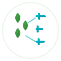

# 🌱 AgroSmart

**Monitorização Inteligente para Pequenos Agricultores**

**Startup portuguesa de tecnologia agrícola** que democratiza a agricultura de precisão através de sensores IoT acessíveis e inteligência artificial[^1].

## 📋 Sobre o Projeto

A AgroSmart combina **hardware IoT avançado** com **software intuitivo** para revolucionar a agricultura portuguesa. Nossa solução permite que pequenos e médios agricultores acedam a tecnologia de precisão anteriormente disponível apenas para grandes explorações[^1].

### 🎯 Problema que Resolvemos

- **40% de desperdício de água** em sistemas tradicionais de irrigação[^1]
- Falta de dados precisos para tomada de decisões informadas
- Custos operacionais elevados nas explorações agrícolas
- Impacto ambiental negativo crescente[^1]


### 💡 Nossa Solução

**Sensores IoT + App Móvel + Inteligência Artificial**


| Componente | Preço | Características |
| :-- | :-- | :-- |
| Sensor IoT | €150 | Humidade, temperatura, condutividade, nutrientes |
| App SaaS | €12/mês | Dashboard, alertas, recomendações IA |
| Instalação | €50/hora | Suporte técnico local[^1] |

## 🚀 Características Principais

### 📱 Aplicação Móvel

- **Dashboard em tempo real** com visualização intuitiva
- **Alertas automáticos** para condições críticas
- **Recomendações personalizadas** baseadas em IA
- **Relatórios detalhados** de performance
- **Interface em português** otimizada para agricultores[^1]


### 🌐 Sensores IoT

- **Precisão ±3%** na medição de humidade do solo
- **Resistência IP67** para condições climáticas extremas
- **Conectividade LoRaWAN** para cobertura rural
- **Bateria 2+ anos** com baixo consumo energético[^1]


### 🤖 Inteligência Artificial

- **Algoritmos de otimização** para irrigação eficiente
- **Previsões meteorológicas** integradas
- **Análise de tendências** para melhoria contínua
- **Aprendizagem automática** com dados históricos[^1]


## 🛠️ Tecnologias Utilizadas

### Frontend

- **HTML5** - Estrutura semântica moderna
- **CSS3** - Design responsivo com variáveis CSS
- **JavaScript ES6+** - Interatividade e funcionalidades avançadas


### Backend (Planeado)

- **Node.js** - Runtime JavaScript
- **PostgreSQL** - Base de dados relacional
- **Express.js** - Framework web
- **Socket.io** - Comunicação em tempo real


### IoT \& Cloud

- **LoRaWAN** - Conectividade de sensores
- **AWS/Azure** - Infraestrutura cloud
- **Apache Kafka** - Ingestão de dados
- **Apache Spark** - Processamento de dados[^1]


## 📁 Estrutura do Projeto

```
agrosmart/
│
├── index.html              # Página principal
├── style.css              # Estilos CSS
├── app.js                 # JavaScript principal
├── logo.svg               # Logo da empresa
│
├── docs/                  # Documentação
│   ├── plano-negocio.pdf  # Plano de negócio completo
│   └── README.md          # Este arquivo
│
├── assets/                # Recursos multimédia
│   ├── images/           # Imagens do projeto
│   ├── mockups/          # Mockups da aplicação
│   └── diagrams/         # Diagramas técnicos
│
└── src/                   # Código fonte (desenvolvimento futuro)
    ├── frontend/         # Aplicação móvel
    ├── backend/          # API e serviços
    └── iot/              # Firmware dos sensores
```


## 🏃‍♂️ Como Executar

### Pré-requisitos

- Navegador web moderno (Chrome, Firefox, Safari, Edge)
- Servidor web local (opcional para desenvolvimento)


### Instalação Local

1. **Clone o repositório**
```bash
git clone https://github.com/agrosmart-portugal/agrosmart.git
cd agrosmart
```

2. **Abra o arquivo index.html**
```bash
# Opção 1: Abrir diretamente no navegador
open index.html

# Opção 2: Usar servidor local simples
python -m http.server 8000
# ou
npx serve .
```

3. **Aceda ao projeto**
```
http://localhost:8000
```


### Deploy Online

O projeto está configurado para deploy fácil em:

- **GitHub Pages**
- **Netlify**
- **Vercel**
- **AWS S3 + CloudFront**


## 📊 Dados de Mercado

| Métrica | Valor | Ano |
| :-- | :-- | :-- |
| Mercado AgTech Global | €32.1B | 2025 |
| Exportações Agrícolas PT | €2.5B | 2024 |
| Explorações Agrícolas PT | 160.000 | - |
| Taxa Crescimento AgTech | 15%/ano | - |

## 🏆 Vantagem Competitiva

| AgroSmart | Farm21 (NL) | John Deere (EUA) |
| :-- | :-- | :-- |
| €150 + €12/mês | €295 + €63/mês | €800 + €80/mês |
| Foco pequenos agricultores | PME agrícolas | Grandes explorações |
| Suporte local português | Cobertura europeia | Cobertura global |
| Interface simplificada | Tecnologia avançada | Integração total[^1] |

## 🗓️ Roadmap

### 2025

- **Q2**: Validação MVP com €25k investimento
- **Q3**: Primeiros 10 clientes com €15k marketing
- **Q4**: Ronda Seed €150k[^1]


### 2026-2028

- **2026**: 75 clientes e expansão da equipa
- **2027**: 165 clientes e otimização de produto
- **2028**: Break-even com 461 clientes[^1]


### 2029-2030

- **2029**: Expansão Espanha e Series A €500k
- **2030**: 5.617 clientes e €1.6M receita anual[^1]


## 👥 Equipa Fundadora

| Nome | Função | Responsabilidades |
| :-- | :-- | :-- |
| **Daniel Nunes** | CEO \& CTO | Liderança estratégica e desenvolvimento tecnológico |
| **Karim Patatas** | COO \& Head of Product | Operações e desenvolvimento de produto |
| **Vasco Neves** | CFO \& Head of Marketing | Finanças e estratégia de mercado[^1] |

## 🤝 Como Contribuir

Valorizamos contribuições da comunidade! Veja como pode ajudar:

### Reportar Bugs

1. Verifique se o bug já foi reportado
2. Crie uma issue detalhada
3. Inclua passos para reproduzir
4. Adicione screenshots se relevante

### Sugerir Melhorias

1. Abra uma issue com tag "enhancement"
2. Descreva detalhadamente a proposta
3. Explique o benefício para os utilizadores
4. Considere implementação técnica

### Desenvolvimento

1. **Fork** o projeto
2. Crie uma **branch** para sua feature (`git checkout -b feature/AmazingFeature`)
3. **Commit** suas mudanças (`git commit -m 'Add some AmazingFeature'`)
4. **Push** para a branch (`git push origin feature/AmazingFeature`)
5. Abra um **Pull Request**

### Código de Conduta

- Seja respeitoso e inclusivo
- Foque no problema, não na pessoa
- Aceite feedback construtivo
- Ajude outros a aprender


## 📈 Métricas de Negócio

### Projeções Financeiras (2025-2030)

| Ano | Clientes | Receita | Lucro | Margem |
| :-- | :-- | :-- | :-- | :-- |
| 2025 | 50 | €14.7k | -€87.5k | -595% |
| 2026 | 75 | €22.1k | -€83.3k | -378% |
| 2027 | 165 | €48.5k | -€68.0k | -140% |
| 2028 | 461 | €135.5k | -€17.7k | -13% |
| 2029 | 1.478 | €434.5k | €155.1k | 36% |
| 2030 | 5.617 | €1.651M | €858.3k | 52%[^1] |

### Métricas SaaS

| Métrica | 2025 | 2030 | Evolução |
| :-- | :-- | :-- | :-- |
| Churn Rate | 15% | 5% | ⬇️ 67% |
| CAC (Customer Acquisition Cost) | €50 | €75 | ⬆️ 50% |
| LTV (Lifetime Value) | €960 | €2.880 | ⬆️ 200% |
| LTV/CAC Ratio | 19.2x | 38.4x | ⬆️ 100%[^1] |

## 🏅 Reconhecimentos e Parcerias

### Parcerias Estratégicas

- **CAP** - Confederação dos Agricultores de Portugal
- **CONFAGRI** - Confederação Nacional das Cooperativas Agrícolas
- **IST** - Instituto Superior Técnico
- **INIAV** - Instituto Nacional de Investigação Agrária[^1]


### Financiamento Potencial

- **Portugal 2030** - €50M disponíveis
- **Horizonte Europa** - €95.5B programa
- **Venture Capital Nacional** - €200M mercado
- **Business Angels** - €50M setor[^1]


## 📞 Contacto

### Informações Gerais

- **Website**: [agrosmart.pt](https://agrosmart.pt)
- **Email**: info@agrosmart.pt
- **Telefone**: +351 XXX XXX XXX


### Equipa

- **CEO**: daniel.nunes@agrosmart.pt
- **COO**: karim.patatas@agrosmart.pt
- **CFO**: vasco.neves@agrosmart.pt


### Redes Sociais

- **LinkedIn**: [/company/agrosmart-portugal](https://linkedin.com/company/agrosmart-portugal)
- **Twitter**: [@AgroSmartPT](https://twitter.com/AgroSmartPT)
- **Facebook**: [/AgroSmartPortugal](https://facebook.com/AgroSmartPortugal)


## 📄 Licença

Este projeto está licenciado sob a **MIT License** - veja o arquivo [LICENSE](LICENSE) para detalhes.

```
MIT License

Copyright (c) 2025 AgroSmart Portugal

Permission is hereby granted, free of charge, to any person obtaining a copy
of this software and associated documentation files (the "Software"), to deal
in the Software without restriction, including without limitation the rights
to use, copy, modify, merge, publish, distribute, sublicense, and/or sell
copies of the Software, and to permit persons to whom the Software is
furnished to do so, subject to the following conditions:

The above copyright notice and this permission notice shall be included in all
copies or substantial portions of the Software.
```


## ⚠️ Disclaimer

Este projeto é um **protótipo educacional** desenvolvido para demonstrar conceitos de AgTech e desenvolvimento web. As projeções financeiras e dados de mercado são baseados em pesquisa acadêmica e devem ser validados antes de uso comercial.

---

**🌱 Transformando a agricultura portuguesa, um sensor de cada vez.**

**Made with ❤️ in Portugal** 🇵🇹


